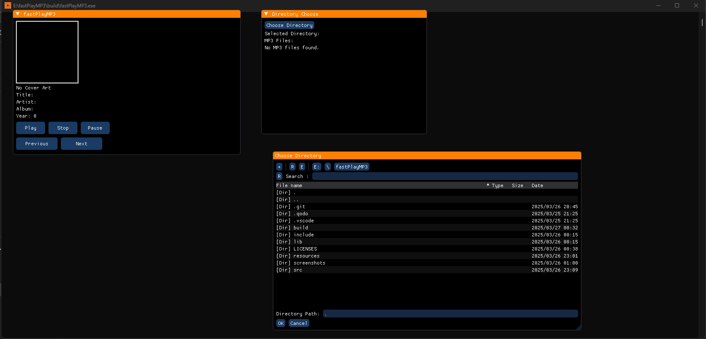

## fastPlayMP3 - Version 1.1

This is the 1.4 version of the fastPlayMP3. 



## License

This project is licensed under the Apache License 2.0. See the `LICENSE` file for details.

## Third-Party Libraries

This project uses the following third-party libraries:

- **GLFW**: Licensed under the zlib/libpng license.
- **ImGui**: Licensed under the MIT License.
- **ImGuiFileDialog**: Licensed under the MIT License.
- **OpenAL**: Licensed under the LGPL.
- **libmpg123**: Licensed under the LGPL.
- **TagLib**: Licensed under the LGPL and MPL.

Please see the `LICENSES` directory for more information.

## Building and Running

### Prerequisites

- **CMake**: Ensure CMake is installed on your system.
- **Compiler**: You need a C++ compiler that supports C++17. This could be GCC, Clang, or MSVC.
- **OpenGL**: Ensure that OpenGL is installed on your system. Most systems come with OpenGL pre-installed, but you may need to install development packages or drivers for your specific graphics card.

### Building with CMake

1. **Standard Build**:
   - Open a terminal and navigate to the root directory of the repository.
   - Run the following commands:
     ```bash
     cmake -B build
     cmake --build build
     ```
   - The executable will be generated at `build/fastPlayMP3.exe`.

2. **Building with MinGW**:
   - If you are using MinGW, use the following commands:
     ```bash
     cmake -B build -G "MinGW Makefiles"
     cmake --build build
     ```
   - The executable will be generated at `build/fastPlayMP3.exe`.

### Running the Application

- After building, navigate to the `build` directory and run exe:
  ```bash
  cd build
  ./fastPlayMP3.exe
